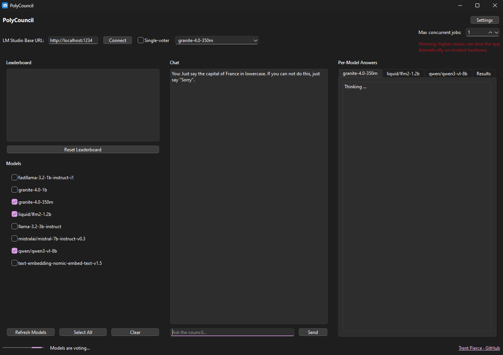
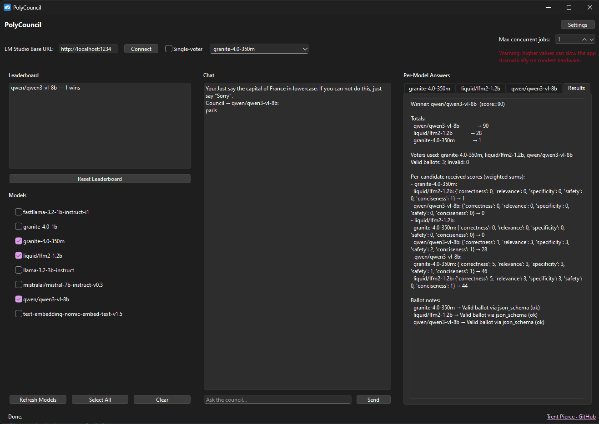

# PolyCouncil

<div align="center">

**A multi-model deliberation engine for LM Studio**

*Running a single model gives you one perspective. Running a council gives you… perspective squared.*

[](https://www.python.org/)
[](LICENSE)
[](https://lmstudio.ai/)
[](https://github.com/TrentPierce/PolyCouncil)

[](https://github.com/TrentPierce/PolyCouncil/stargazers)
[](https://github.com/TrentPierce/PolyCouncil/network/members)
[](https://github.com/TrentPierce/PolyCouncil/issues)
[](https://github.com/TrentPierce/PolyCouncil/pulls)

</div>

---

## Overview

PolyCouncil is an open-source application that orchestrates multiple local Large Language Models (LLMs) running in LM Studio. Instead of querying a single model, PolyCouncil runs multiple models in parallel, has them evaluate each other's responses using a shared scoring rubric, and then conducts a weighted voting process to determine the best answer through consensus.

This creates a more reliable, research-friendly way to:
- **Test and compare** different local models
- **Improve answer quality** through ensemble methods
- **Explore emergent behavior** from model deliberation
- **Benchmark models** against each other systematically

### How It Works

1. **Parallel Execution**: Multiple models answer the same question simultaneously
2. **Cross-Evaluation**: Each model scores every other model's response using a shared rubric
3. **Weighted Voting**: Models vote on which answer is best, with votes weighted by their rubric scores
4. **Consensus Result**: The winning answer is determined through democratic deliberation

---

## Features

### Core Functionality

- **Parallel Model Execution**: Run multiple local LLMs simultaneously and collect answers in parallel
- **Rubric-Based Scoring**: Each model evaluates every other response across customizable criteria (accuracy, clarity, completeness, etc.)
- **Consensus Voting System**: Final answer chosen through weighted voting based on rubric scores
- **Leaderboard Tracking**: Track which models perform best over time with persistent statistics

### Persona System

- **Custom Personas**: Create and assign different personas to different models for varied perspectives
- **Built-in Personas**: Includes recommended personas:
  - Meticulous fact-checker
  - Pragmatic engineer
  - Cautious risk assessor
  - Clear teacher
  - Data analyst
  - Systems thinker
- **Per-Model Assignment**: Apply different personas to different models simultaneously to test how perspectives affect responses

### Advanced Modes

- **Single-Voter (Judge) Mode**: Use one model as the "ultimate judge" for all votes while all models still answer
- **Adjustable Concurrency**: Control how many models run simultaneously (1-8 concurrent jobs)
- **Debug Mode**: Toggle verbose logging to see detailed scoring, voting, and deliberation processes
- **Auto-Discovery**: Automatically detect available models from LM Studio

### User Interface

- **Centralized Settings**: Easy-to-use settings dialog for configuration
- **Debug Log Dock**: Dockable panel for detailed analysis of the deliberation process
- **Modern UI**: Clean, intuitive interface built with PySide6 with automatic dark/light theme support
- **Persistent Settings**: All preferences saved automatically

---

## Quick Start

### Option 1: Standalone Executable (Recommended for Windows)

1. **Download** the latest `PolyCouncil.exe` from [Releases](https://github.com/TrentPierce/PolyCouncil/releases)
2. **Start LM Studio** and load at least one model
3. **Launch** `PolyCouncil.exe` (no installation required!)
4. **Connect** to LM Studio by clicking "Connect"
5. **Select models** you want to use
6. **Ask questions** and watch the council deliberate!

### Option 2: Run from Source

```bash
# Clone the repository
git clone https://github.com/TrentPierce/PolyCouncil.git
cd PolyCouncil

# Install dependencies
pip install -r requirements.txt

# Run the application
python council.py
```

---

## Requirements

### For Standalone Executable
- **Windows 10/11** (64-bit)
- **LM Studio** installed and running
- **At least one model** loaded in LM Studio
- **~50 MB** disk space for the executable

### For Source Installation
- **Python 3.10+**
- **LM Studio** installed and running
- **pip** (Python package manager)
- **Dependencies** listed in `requirements.txt`:
  - PySide6 (GUI framework)
  - aiohttp (async HTTP client)
  - requests (HTTP library)
  - qdarktheme (optional, for theme support)

---

## Usage Guide

### First Time Setup

1. **Launch LM Studio** and ensure at least one model is loaded
2. **Start PolyCouncil** (either EXE or `python council.py`)
3. **Configure Base URL** (default: `http://localhost:1234`) if LM Studio uses a different port
4. **Click "Connect"** to discover available models
5. **Select models** by checking the boxes next to model names

### Using Personas

Personas allow you to give different models different perspectives or roles:

1. Open **Settings** (top-right button)
2. Check **"Enable personas"**
3. Click the **"Persona"** button next to each model
4. Select a persona from the menu
5. Each model will now approach questions from that persona's perspective

**Example**: Assign "Meticulous fact-checker" to one model and "Pragmatic engineer" to another to see how different perspectives affect their answers.

### Single-Voter (Judge) Mode

Use one model as the judge while all models answer:

1. Check **"Single-voter"** in the main window
2. Select which model should act as the judge from the dropdown
3. All models will answer the question
4. Only the selected judge model will vote on which answer is best

This is useful for testing how different models evaluate responses.

### Debug Mode

Enable detailed logging to understand the deliberation process:

1. Open **Settings**
2. Check **"Enable debug logs"**
3. A dockable log panel will appear showing:
   - Individual model responses
   - Scoring details
   - Voting ballots
   - Final consensus calculation

### Adjusting Concurrency

Control how many models run simultaneously:

1. Adjust the **"Max concurrent jobs"** spinner (1-8)
2. Higher values = faster but more resource-intensive
3. Lower values = slower but more stable on modest hardware

---

## Use Cases

### Model Benchmarking
Compare how different models perform on the same questions. The leaderboard tracks which models win most often.

### Research & Experimentation
Explore emergent behavior from model voting and deliberation. See how ensemble methods improve reliability.

### Quality Improvement
Get more reliable answers by combining multiple model perspectives. The consensus approach often produces better results than any single model.

### Educational
Understand how ensemble methods, voting systems, and multi-agent systems work in practice.

### Persona Testing
Test how different personas affect model responses. Useful for understanding bias, perspective, and role-playing in LLMs.

---

## Screenshots





---

## Configuration

PolyCouncil automatically saves your preferences, including:
- LM Studio base URL
- Selected models
- Persona assignments
- Concurrency settings
- Debug mode preference
- Single-voter settings

Settings are stored in `council_settings.json` in the application directory.

---

## Troubleshooting

### Models Not Appearing
- Ensure LM Studio is running
- Verify at least one model is loaded in LM Studio
- Check that the base URL is correct (default: `http://localhost:1234`)
- Click "Refresh Models" if needed

### Slow Performance
- Reduce "Max concurrent jobs" to 1-2
- Close other resource-intensive applications
- Ensure your models fit in available RAM

### Icon Not Displaying (Windows)
- Windows may cache icons - restart File Explorer
- Move the EXE to a different location to force refresh

### Connection Errors
- Verify LM Studio is running
- Check firewall settings
- Ensure LM Studio API is enabled (default port 1234)

---

## Contributing

Contributions are welcome! Whether it's:
- Fixing bugs
- Improving the GUI
- Optimizing performance
- Adding new features
- Improving documentation

Please feel free to open an issue or submit a pull request. All contributions help the council grow smarter!

### Development Setup

```bash
git clone https://github.com/TrentPierce/PolyCouncil.git
cd PolyCouncil
pip install -r requirements.txt
python council.py
```

---

## License

This project is licensed under the **Polyform Noncommercial License 1.0.0**.

- ✅ **Free for personal and research use**
- ✅ **Free to modify and share**
- ❌ **Commercial use is not permitted**

See [LICENSE](LICENSE) for full details.

---

## Roadmap

Future enhancements planned:

- [ ] Web UI version
- [ ] More advanced judge agents
- [ ] Plugin system for custom scoring rules
- [ ] Model personality profiles / bias testing
- [ ] Automatic answer explanation generator
- [ ] Graph-based deliberation visualization
- [ ] Export results to various formats
- [ ] Model performance analytics dashboard

---

## Acknowledgments

Built for model tinkerers, curious minds, and anyone who enjoys watching artificial brains argue politely.

Special thanks to:
- The LM Studio team for creating an amazing local LLM platform
- The open-source community for inspiration and tools
- All contributors and users who help improve PolyCouncil

---

## Support

- **Found a bug?** [Open an issue](https://github.com/TrentPierce/PolyCouncil/issues)
- **Have a feature request?** [Open an issue](https://github.com/TrentPierce/PolyCouncil/issues)
- **Need help?** Check existing issues or open a new one
- **Like the project?** Star it on GitHub!

---

<div align="center">

**Enjoy exploring the power of multi-model deliberation!**

Made with care for the local LLM community

</div>
