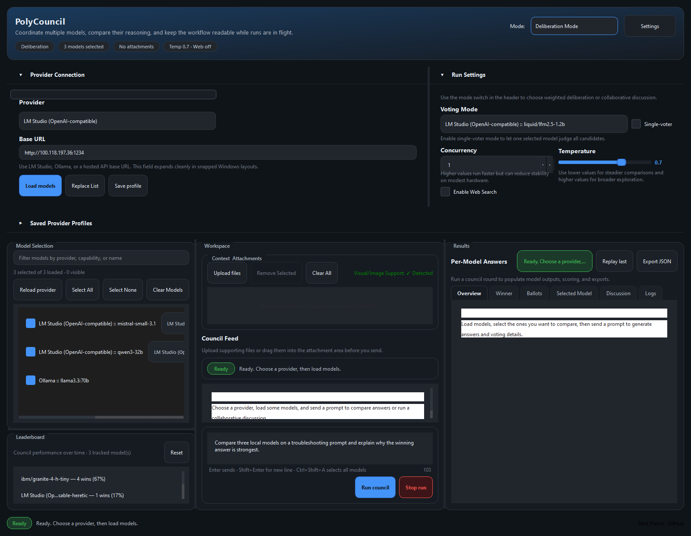
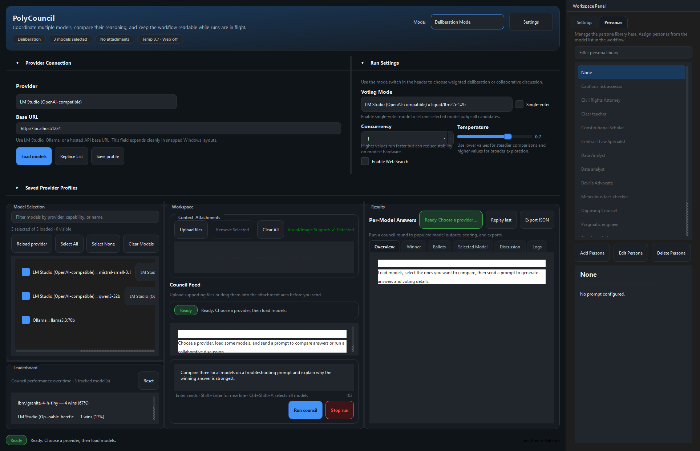
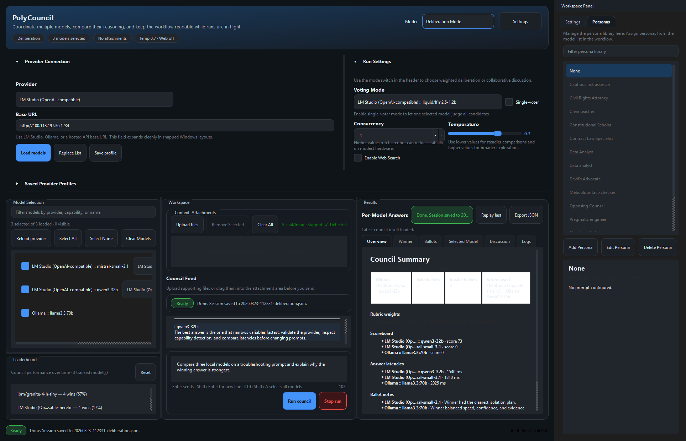

# PolyCouncil

<div align="center">

**A Windows-first desktop app for multi-model deliberation and discussion**

*Run several models at once, compare their reasoning, and keep the full decision trail.*

[](https://www.python.org/)
[](LICENSE)
[](https://github.com/TrentPierce/PolyCouncil)
[](https://github.com/TrentPierce/PolyCouncil)

[](https://github.com/TrentPierce/PolyCouncil/stargazers)
[](https://github.com/TrentPierce/PolyCouncil/network/members)
[](https://github.com/TrentPierce/PolyCouncil/issues)
[](https://github.com/TrentPierce/PolyCouncil/pulls)

</div>

---

## Overview

PolyCouncil orchestrates multiple LLMs across local and hosted providers, then helps you review the outcome as a structured desktop workflow instead of a loose pile of responses.

The app supports two primary modes:

1. **Deliberation Mode**
   Multiple models answer the same prompt, score each other using a shared rubric, and produce a weighted winner.
2. **Collaborative Discussion Mode**
   Multiple models discuss the prompt across turns and generate a synthesized report.

This makes PolyCouncil useful for:
- comparing local and hosted models side by side
- stress-testing prompts across different model families
- benchmarking models with transparent scoring
- running persona-based review panels
- preserving a replayable session history for later analysis

---

## What Changed In The Current UI

The current app is no longer the older "one dense window plus large modal settings dialog" layout.

The latest desktop build now uses:
- a workflow-first main window with clear sections for provider setup, model selection, composition, and review
- a docked **Workspace Panel** for stable settings and persona-library management
- a fixed results model with `Overview`, `Winner`, `Ballots`, `Selected Model`, `Discussion`, and `Logs`
- list-details model inspection instead of unbounded dynamic tabs
- stronger in-context run state near the workspace and results area

---

## Screenshots

### Main Workflow



### Settings And Persona Library



### Results Overview



---

## Features

### Deliberation

- Parallel multi-model execution
- Weighted voting with configurable rubric weights
- Single-voter mode for judge-style evaluation
- Per-run answer latency tracking
- Session replay and JSON export

### Discussion

- Multi-turn collaborative discussion mode
- Live transcript updates
- Final synthesis report
- Markdown export for discussion sessions

### Providers

- LM Studio via OpenAI-compatible local API
- Ollama local runtime
- Hosted OpenAI-compatible APIs
- Saved provider profiles for quick switching

### Workflow And Review

- Searchable model list with provider and capability metadata
- Persona assignment directly from model rows
- Fixed review surfaces for winner, ballots, logs, and per-model inspection
- Docked debug log for deeper analysis

### Safety And Persistence

- Safe markdown rendering for model output
- Platform-native config/data directories
- Session history saved as JSON
- Hosted API keys stored in the OS keychain when available

---

## Quick Start

### Option 1: Standalone EXE on Windows

1. Download the latest `PolyCouncil.exe` from [Releases](https://github.com/TrentPierce/PolyCouncil/releases).
2. Start LM Studio or Ollama, or prepare a hosted API endpoint.
3. Launch `PolyCouncil.exe`.
4. In **Provider Connection**, choose a provider and click **Load models**.
5. In **Model Selection**, check the models you want to use.
6. Enter a prompt in the composer and click **Run council**.
7. Review the result in `Overview`, `Winner`, `Ballots`, or `Selected Model`.

### Option 2: Run From Source

```bash
git clone https://github.com/TrentPierce/PolyCouncil.git
cd PolyCouncil
pip install -r requirements.txt
python council.py
```

---

## Requirements

### Standalone EXE

- Windows 10 or Windows 11
- LM Studio, Ollama, or a hosted OpenAI-compatible API
- At least one available model

### Source Install

- Python 3.10+
- pip
- Dependencies from `requirements.txt`

Core packages:
- `PySide6`
- `aiohttp`
- `requests`
- `pypdf`
- `python-docx`
- `markdown`
- `bleach`
- `keyring`

---

## Workflow Guide

## 1. Connect A Provider

Use the **Provider Connection** section to choose:
- `LM Studio (OpenAI-compatible)`
- `Ollama`
- `OpenAI-compatible API`

For hosted APIs, choose a preset or custom service, enter the base URL if needed, and supply an API key.

Use:
- **Load models** to append models from the selected provider
- **Replace List** to reset the current model list from the selected provider
- **Save profile** to store a reusable provider configuration

## 2. Select Models

Use the **Model Selection** pane to:
- filter large model lists
- select all or clear all
- inspect provider and capability badges
- assign personas from the model row action

## 3. Compose A Prompt

The main composer supports:
- `Enter` to run
- `Shift+Enter` for a new line
- file attachments
- image attachments when a selected model supports visual input

## 4. Run In Deliberation Or Discussion Mode

Switch modes from the header:

- **Deliberation Mode**
  Produces weighted scoring, a winner, and ballot summaries.
- **Collaborative Discussion Mode**
  Produces a live transcript and a final synthesis.

## 5. Review Results

The results area uses a fixed information model:

- **Overview**
  High-level summary of the run
- **Winner**
  Winning answer in deliberation mode
- **Ballots**
  Voting notes, scoring, and totals
- **Selected Model**
  List-details inspection for a specific model
- **Discussion**
  Transcript and discussion output
- **Logs**
  Inline runtime log view

---

## Personas

Persona controls are shown in the workflow and managed from the docked **Workspace Panel**.

Use personas to give models different review styles such as:
- meticulous fact-checker
- pragmatic engineer
- cautious risk assessor
- clear teacher
- data analyst
- systems thinker

The **Personas** tab in the Workspace Panel lets you:
- search the persona library
- preview persona prompts
- add custom personas
- edit custom personas
- delete custom personas

---

## Settings And Data

The **Workspace Panel** contains stable settings instead of blocking modal setup.

Current settings include:
- debug logging
- showing or hiding persona controls in the workflow
- keyboard shortcut access
- support links

Data locations:

- **Settings / profiles / user personas**
  - Windows: `%APPDATA%\PolyCouncil`
  - macOS: `~/Library/Application Support/PolyCouncil`
  - Linux: `${XDG_CONFIG_HOME:-~/.config}/PolyCouncil`
- **Leaderboard database / session history**
  - Windows: `%LOCALAPPDATA%\PolyCouncil`
  - macOS: `~/Library/Application Support/PolyCouncil`
  - Linux: `${XDG_DATA_HOME:-~/.local/share}/PolyCouncil`

Hosted API keys are not written to plaintext settings files. When the OS keychain is available, PolyCouncil stores them there.

---

## Keyboard Shortcuts

- `Enter` in the prompt editor: run
- `Shift+Enter`: newline
- `Ctrl+Enter`: run from anywhere
- `Ctrl+Shift+A`: select all models
- `Ctrl+R`: reload models
- `Ctrl+L`: focus prompt editor
- `Ctrl+F`: focus model filter
- `Ctrl+/`: open keyboard shortcut help
- `Escape`: stop current operation

---

## Build The EXE

### Quick Build

```bash
python -m PyInstaller build_exe.spec --clean
```

Result:

- `dist/PolyCouncil.exe`

The repository also includes Windows helper scripts such as `build.bat` and icon-related build helpers.

---

## Troubleshooting

### Models Do Not Appear

- verify the provider type and base URL
- confirm the local server is running
- for hosted APIs, confirm a valid API key is set
- use **Replace List** if you want to discard stale loaded models

### Hosted API Key Does Not Persist

- verify a supported keychain backend is available on the machine
- if secure storage is unavailable, the key remains session-only

### Runs Feel Slow

- reduce concurrency to `1` or `2`
- use fewer simultaneous models
- check that the local runtime has enough RAM/VRAM

### Image Upload Is Disabled

- select at least one model with visual support
- image attachments are gated by detected model capability

### Debugging A Bad Run

- open the debug log
- inspect the `Ballots` and `Logs` tabs
- replay the last session
- rerun with lower concurrency to isolate provider issues

---

## Development

```bash
git clone https://github.com/TrentPierce/PolyCouncil.git
cd PolyCouncil
pip install -r requirements-dev.txt
python council.py
```

Tests:

```bash
pytest -q
```

---

## Contributing

Contributions are welcome, especially in:
- UI and workflow polish
- model-provider compatibility
- deliberation quality
- testing
- documentation

Open an issue or submit a pull request if you want to help.

---

## License

This project is licensed under the **Polyform Noncommercial License 1.0.0**.

- Free for personal and research use
- Free to modify and share
- Commercial use is not permitted

See [LICENSE](LICENSE) for details.

---

## Release Notes

- [v1.1.1](docs/releases/RELEASE_NOTES_v1.1.1.md)
- [v1.1.0](docs/releases/RELEASE_NOTES_v1.1.0.md)
- [v1.0.1](docs/releases/RELEASE_NOTES_v1.0.1.md)
- [v1.0.0](docs/releases/RELEASE_NOTES_v1.0.0.md)

---

## Support

- Bug reports: [GitHub Issues](https://github.com/TrentPierce/PolyCouncil/issues)
- Feature requests: [GitHub Issues](https://github.com/TrentPierce/PolyCouncil/issues)
- Project page: [GitHub Repository](https://github.com/TrentPierce/PolyCouncil)

<div align="center">

Built for people who want to see how models compare, disagree, and converge.

</div>
